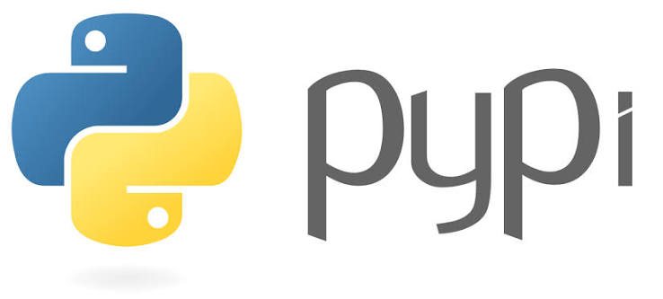

#  🔥 EmbLibPY (Embers Library for Python) 

> Tiny Lil' Python Library made by Ember for fun XD 
> It's got weird stuff to make Kitty Sounds, do unnecessary Math, and some fun text functions! 😺✖️🔡

<p align="center">
  
  meow
</p>

#  Functions
> meowSound(type)


> lowestCommonFactor(numbers)

> highestCommonMultiple(numbers, limit)

> numGoBrr(number, times)


> wierdCase(text)

> scramble(text)

> skillIssue()

(told you it was weird :) )

# Installation

<a href = "https://pypi.org/project/emblibpy/"></a>

We can install the library using pip, just run the following command in your terminal:
```bash
pip install emblibpy
```
(yea its as easy as that :P)


